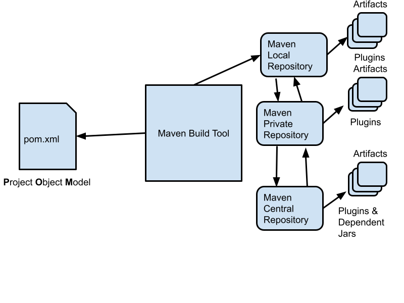

# devops-sep-2021

### From your rps Lab Machine, launch a terminal and type this command to see if you have sudo permission
```
sudo yum install -y epel-release
```
When prompted for password, you need to type rps@12345

### In case you don't have JDK installed, you may install as shown below
```
sudo yum install -y java-11-openjdk-devel
```

### Check if you have java compiler (Try this as rps user)
```
javac -version
```

### Check if you have java runtime (try this as rps user)
```
java -version
```

### Setting up Maven build tool
```
cd ~/Downloads
wget https://dlcdn.apache.org/maven/maven-3/3.8.2/binaries/apache-maven-3.8.2-bin.tar.gz
tar xvfz apache-maven-3.8.2-bin.tar.gz
```

### Setting Java and Maven environment path
Make sure you append the below line into your ~/.bashrc file and save it.
```
# User specific aliases and functions
export JAVA_HOME=/usr/lib/jvm/java-11-openjdk-11.0.12.0.7-0.el8_4.x86_64
export M2_HOME=/home/jegan/Downloads/apache-maven-3.8.2
export PATH=$JAVA_HOME/bin:$M2_HOME/bin:$PATH
```
In order to apply the changes, let's run
```
source ~/.bashrc
```

### Maven Architecture


### Check if you have maven build tool installed
```
mvn --version
```
The expected output is
<pre>
[jegan@tektutor ~]$ mvn --version
Apache Maven 3.8.2 (ea98e05a04480131370aa0c110b8c54cf726c06f)
Maven home: /home/jegan/Downloads/apache-maven-3.8.2
Java version: 11.0.12, vendor: Red Hat, Inc., runtime: /usr/lib/jvm/java-11-openjdk-11.0.12.0.7-0.el8_4.x86_64
Default locale: en_US, platform encoding: UTF-8
OS name: "linux", version: "4.18.0-240.el8.x86_64", arch: "amd64", family: "unix"
</pre>

### Ant Build tool
- Apache Foundation 
- opensource tool
- used by Java projects
- build instructions are written in an xml file (build.xml)
- has no built-in features to manage your project dependencies
- doesn't have any standard conventions for 
    - how you name your project
    - how you name your artifacts (jar, war, ear, etc.,)
    - how your project folder structure should look like
- things get complicated as the project complexity increases
- Apache Team who developed Ant build tool, when they used Ant as a build tool for one of their projects called Jakarta they
  realized it is too complex to use Ant for such a complex project/project. Hence they wanted to improve the build tool and that's 
  how Maven build tool was created.

### What is Maven?
- a build tool developed Apache Foundataion
- opensource tool
- used predominantly by Java projects but it is technology agnostic tool(can be used by C/C++, C#(.Net), etc.,)
- build naturally is a better tool than Ant
- suports dependency management 
- Convention over Configuration
  80 - 20 Principle
    - as per this principle, it seems 80% of time only 20% of features of any product is used
    - in other words, 80% of the people only use 20% of the features offered by any product
    - Big organizations takes User Experience very seriously, hence they identify the most common use cases and they make those
      features easy to access.  While the advanced use cases are still possible but may require some extra configurations.
- Maven co-ordinates
   - is a convention insisted by Maven on how to name your project or artifacts(binary package)
   - 3 Co-ordinates
     1. GroupId - generally reverse domain name of your organization is used 
        -  if microsoft.com is the domain, reverse doman name is com.microsoft
     3. ArtifactId
        - this is name of jar, war, ear, zip, etc.,
     5. Version
        - 1.2.3
            - 1 refers to major version
            - 2 refers to minor version
            - 3 refers to incremental version
     - maven co-ordinates has to choen carefully in a such a way that the combination of all 3 coordinates must be unique
  - Repositories
     - a collection of third-party opensource libraries
     - 3 type of Repositories
       1. Local repository 
          - maintained in your system local folder ( Under User home, maven creates a hidden .m2 folder )
       3. Private repository
          - can be optionally setup using
              1. In Docker Hub - Docker Image ( registry:2 )
              2. Sonatype Nexus 
              3. JFrog Artifactory
          - in case you are working in a closed-source project/product, then you need all the functionalities of Central Repository
            within in your organization.
       5. Central repositroy ( Maven Central Repo website - https://search.maven.org/
          - has all open source artifacts
          - you could also contribute but it would be a open source library
     - eg. 
         - JUnit Test Framework jar files
         - Mockito Mocking Framework jar files
         - Eazy Mock Framework jar files
         - Log4J - Logging utility jar files
         - spring boot framework jar files

### Create a training folder to clone the TekTutor GitHub Repository
```
cd ~
mkdir Training
cd Training
git clone https://github.com/tektutor/devops-sep-2021.git
cd devops-sep-2021
```
### Compiling the Hello Maven project
```
cd ~/Training/devops-sep-2021
git pull
cd Day1/Hello
mvn compile
```

### Checking the effective pom
```
cd ~/Training/devops-sep-2021
cd Day1/Hello
mvn help:effective-pom
```

### Listing the default life-cycle phases
```
mvn help:describe -Dcmd=compile
```
The expected output is
<pre>
[jegan@tektutor Hello]$ <b>mvn help:describe -Dcmd=compile</b>
[INFO] Scanning for projects...
[INFO] 
[INFO] ------------------< org.tektutor:tektutor-hello-app >-------------------
[INFO] Building tektutor-hello-app 1.0.0
[INFO] --------------------------------[ jar ]---------------------------------
[INFO] 
[INFO] --- maven-help-plugin:3.2.0:describe (default-cli) @ tektutor-hello-app ---
[INFO] 'compile' is a phase corresponding to this plugin:
org.apache.maven.plugins:maven-compiler-plugin:3.1:compile

It is a part of the lifecycle for the POM packaging 'jar'. This lifecycle includes the following phases:
* validate: Not defined
* initialize: Not defined
* generate-sources: Not defined
* process-sources: Not defined
* generate-resources: Not defined
* process-resources: org.apache.maven.plugins:maven-resources-plugin:2.6:resources
* compile: org.apache.maven.plugins:maven-compiler-plugin:3.1:compile
* process-classes: Not defined
* generate-test-sources: Not defined
* process-test-sources: Not defined
* generate-test-resources: Not defined
* process-test-resources: org.apache.maven.plugins:maven-resources-plugin:2.6:testResources
* test-compile: org.apache.maven.plugins:maven-compiler-plugin:3.1:testCompile
* process-test-classes: Not defined
* test: org.apache.maven.plugins:maven-surefire-plugin:2.12.4:test
* prepare-package: Not defined
* package: org.apache.maven.plugins:maven-jar-plugin:2.4:jar
* pre-integration-test: Not defined
* integration-test: Not defined
* post-integration-test: Not defined
* verify: Not defined
* install: org.apache.maven.plugins:maven-install-plugin:2.4:install
* deploy: org.apache.maven.plugins:maven-deploy-plugin:2.7:deploy

[INFO] ------------------------------------------------------------------------
[INFO] BUILD SUCCESS
[INFO] ------------------------------------------------------------------------
[INFO] Total time:  0.602 s
[INFO] Finished at: 2021-09-27T01:56:17-07:00
[INFO] ------------------------------------------------------------------------
</pre>

### Listing the clean life-cycle phases
```
mvn help:describe -Dcmd=clean
```
The expected output is
<pre>
[jegan@tektutor Hello]$ <b>mvn help:describe -Dcmd=clean</b>
[INFO] Scanning for projects...
[INFO] 
[INFO] ------------------< org.tektutor:tektutor-hello-app >-------------------
[INFO] Building tektutor-hello-app 1.0.0
[INFO] --------------------------------[ jar ]---------------------------------
[INFO] 
[INFO] --- maven-help-plugin:3.2.0:describe (default-cli) @ tektutor-hello-app ---
[INFO] 'clean' is a phase within the 'clean' lifecycle, which has the following phases: 
* pre-clean: Not defined
* clean: org.apache.maven.plugins:maven-clean-plugin:2.5:clean
* post-clean: Not defined

[INFO] ------------------------------------------------------------------------
[INFO] BUILD SUCCESS
[INFO] ------------------------------------------------------------------------
[INFO] Total time:  0.681 s
[INFO] Finished at: 2021-09-27T03:06:33-07:00
[INFO] ------------------------------------------------------------------------
</pre>

### Listing the site life-cycle phases
```
mvn help:describe -Dcmd=site
```
The expected output is
<pre>
[jegan@tektutor Hello]$ <b>mvn help:describe -Dcmd=site</b>
[INFO] Scanning for projects...
[INFO] 
[INFO] ------------------< org.tektutor:tektutor-hello-app >-------------------
[INFO] Building tektutor-hello-app 1.0.0
[INFO] --------------------------------[ jar ]---------------------------------
[INFO] 
[INFO] --- maven-help-plugin:3.2.0:describe (default-cli) @ tektutor-hello-app ---
[INFO] 'site' is a phase within the 'site' lifecycle, which has the following phases: 
* pre-site: Not defined
* site: org.apache.maven.plugins:maven-site-plugin:3.3:site
* post-site: Not defined
* site-deploy: org.apache.maven.plugins:maven-site-plugin:3.3:deploy

[INFO] ------------------------------------------------------------------------
[INFO] BUILD SUCCESS
[INFO] ------------------------------------------------------------------------
[INFO] Total time:  0.633 s
[INFO] Finished at: 2021-09-27T03:07:18-07:00
[INFO] ------------------------------------------------------------------------
[jegan@tektutor Hello]$ 
</pre>

### Finding the goals supported by maven compiler plugin
```
mvn help:describe -Dplugin=org.apache.maven.plugins:maven-compiler-plugin:3.1
```
The expected output is
<pre>
[jegan@tektutor Hello]$ <b>mvn help:describe -Dplugin=org.apache.maven.plugins:maven-compiler-plugin:3.1</b>
[INFO] Scanning for projects...
[INFO] 
[INFO] ------------------< org.tektutor:tektutor-hello-app >-------------------
[INFO] Building tektutor-hello-app 1.0.0
[INFO] --------------------------------[ jar ]---------------------------------
[INFO] 
[INFO] --- maven-help-plugin:3.2.0:describe (default-cli) @ tektutor-hello-app ---
[INFO] org.apache.maven.plugins:maven-compiler-plugin:3.1

Name: Maven Compiler Plugin
Description: The Compiler Plugin is used to compile the sources of your
  project.
Group Id: org.apache.maven.plugins
Artifact Id: maven-compiler-plugin
Version: 3.1
Goal Prefix: compiler

This plugin has 3 goals:

compiler:compile
  Description: Compiles application sources

compiler:help
  Description: Display help information on maven-compiler-plugin.
    Call mvn compiler:help -Ddetail=true -Dgoal=<goal-name> to display
    parameter details.

compiler:testCompile
  Description: Compiles application test sources.

For more information, run 'mvn help:describe [...] -Ddetail'

[INFO] ------------------------------------------------------------------------
[INFO] BUILD SUCCESS
[INFO] ------------------------------------------------------------------------
[INFO] Total time:  1.176 s
[INFO] Finished at: 2021-09-27T03:09:10-07:00
[INFO] ------------------------------------------------------------------------
</pre>

### Seeing the effective pom file
```
cd ~/Training/devops-sep-2021
git pull
cd Day1/Hello
mvn help:effective-pom
```
The expected output is
<pre>
[jegan@tektutor Hello]$ <b>mvn help:effective-pom</b>
</pre>
```
[INFO] Scanning for projects...
[INFO] 
[INFO] ------------------< org.tektutor:tektutor-hello-app >-------------------
[INFO] Building tektutor-hello-app 1.0.0
[INFO] --------------------------------[ jar ]---------------------------------
[INFO] 
[INFO] --- maven-help-plugin:3.2.0:effective-pom (default-cli) @ tektutor-hello-app ---
[INFO] 
Effective POMs, after inheritance, interpolation, and profiles are applied:

<?xml version="1.0" encoding="UTF-8"?>
<!-- ====================================================================== -->
<!--                                                                        -->
<!-- Generated by Maven Help Plugin on 2021-09-27T03:12:46-07:00            -->
<!-- See: http://maven.apache.org/plugins/maven-help-plugin/                -->
<!--                                                                        -->
<!-- ====================================================================== -->
<!-- ====================================================================== -->
<!--                                                                        -->
<!-- Effective POM for project 'org.tektutor:tektutor-hello-app:jar:1.0.0'  -->
<!--                                                                        -->
<!-- ====================================================================== -->
<project xmlns="http://maven.apache.org/POM/4.0.0" xmlns:xsi="http://www.w3.org/2001/XMLSchema-instance" xsi:schemaLocation="http://maven.apache.org/POM/4.0.0 https://maven.apache.org/xsd/maven-4.0.0.xsd">
  <modelVersion>4.0.0</modelVersion>
  <groupId>org.tektutor</groupId>
  <artifactId>tektutor-hello-app</artifactId>
  <version>1.0.0</version>
  <properties>
    <maven.compiler.source>1.10</maven.compiler.source>
    <maven.compiler.target>1.10</maven.compiler.target>
  </properties>
  <dependencies>
    <dependency>
      <groupId>junit</groupId>
      <artifactId>junit</artifactId>
      <version>4.12</version>
      <scope>compile</scope>
    </dependency>
  </dependencies>
  <repositories>
    <repository>
      <snapshots>
        <enabled>false</enabled>
      </snapshots>
      <id>central</id>
      <name>Central Repository</name>
      <url>https://repo.maven.apache.org/maven2</url>
    </repository>
  </repositories>
  <pluginRepositories>
    <pluginRepository>
      <releases>
        <updatePolicy>never</updatePolicy>
      </releases>
      <snapshots>
        <enabled>false</enabled>
      </snapshots>
      <id>central</id>
      <name>Central Repository</name>
      <url>https://repo.maven.apache.org/maven2</url>
    </pluginRepository>
  </pluginRepositories>
  <build>
    <sourceDirectory>/home/jegan/Training/devops-sep-2021/Day1/Hello/src/main/java</sourceDirectory>
    <scriptSourceDirectory>/home/jegan/Training/devops-sep-2021/Day1/Hello/src/main/scripts</scriptSourceDirectory>
    <testSourceDirectory>/home/jegan/Training/devops-sep-2021/Day1/Hello/src/test/java</testSourceDirectory>
    <outputDirectory>/home/jegan/Training/devops-sep-2021/Day1/Hello/target/classes</outputDirectory>
    <testOutputDirectory>/home/jegan/Training/devops-sep-2021/Day1/Hello/target/test-classes</testOutputDirectory>
    <resources>
      <resource>
        <directory>/home/jegan/Training/devops-sep-2021/Day1/Hello/src/main/resources</directory>
      </resource>
    </resources>
    <testResources>
      <testResource>
        <directory>/home/jegan/Training/devops-sep-2021/Day1/Hello/src/test/resources</directory>
      </testResource>
    </testResources>
    <directory>/home/jegan/Training/devops-sep-2021/Day1/Hello/target</directory>
    <finalName>tektutor-hello-app-1.0.0</finalName>
    <pluginManagement>
      <plugins>
        <plugin>
          <artifactId>maven-antrun-plugin</artifactId>
          <version>1.3</version>
        </plugin>
        <plugin>
          <artifactId>maven-assembly-plugin</artifactId>
          <version>2.2-beta-5</version>
        </plugin>
        <plugin>
          <artifactId>maven-dependency-plugin</artifactId>
          <version>2.8</version>
        </plugin>
        <plugin>
          <artifactId>maven-release-plugin</artifactId>
          <version>2.5.3</version>
        </plugin>
      </plugins>
    </pluginManagement>
    <plugins>
      <plugin>
        <artifactId>maven-site-plugin</artifactId>
        <version>3.7.1</version>
        <executions>
          <execution>
            <id>default-site</id>
            <phase>site</phase>
            <goals>
              <goal>site</goal>
            </goals>
            <configuration>
              <outputDirectory>/home/jegan/Training/devops-sep-2021/Day1/Hello/target/site</outputDirectory>
              <reportPlugins>
                <reportPlugin>
                  <groupId>org.apache.maven.plugins</groupId>
                  <artifactId>maven-project-info-reports-plugin</artifactId>
                </reportPlugin>
              </reportPlugins>
            </configuration>
          </execution>
          <execution>
            <id>default-deploy</id>
            <phase>site-deploy</phase>
            <goals>
              <goal>deploy</goal>
            </goals>
            <configuration>
              <outputDirectory>/home/jegan/Training/devops-sep-2021/Day1/Hello/target/site</outputDirectory>
              <reportPlugins>
                <reportPlugin>
                  <groupId>org.apache.maven.plugins</groupId>
                  <artifactId>maven-project-info-reports-plugin</artifactId>
                </reportPlugin>
              </reportPlugins>
            </configuration>
          </execution>
        </executions>
        <configuration>
          <outputDirectory>/home/jegan/Training/devops-sep-2021/Day1/Hello/target/site</outputDirectory>
          <reportPlugins>
            <reportPlugin>
              <groupId>org.apache.maven.plugins</groupId>
              <artifactId>maven-project-info-reports-plugin</artifactId>
            </reportPlugin>
          </reportPlugins>
        </configuration>
      </plugin>
      <plugin>
        <artifactId>maven-project-info-reports-plugin</artifactId>
        <version>3.0.0</version>
      </plugin>
      <plugin>
        <artifactId>maven-clean-plugin</artifactId>
        <version>2.5</version>
        <executions>
          <execution>
            <id>default-clean</id>
            <phase>clean</phase>
            <goals>
              <goal>clean</goal>
            </goals>
          </execution>
        </executions>
      </plugin>
      <plugin>
        <artifactId>maven-resources-plugin</artifactId>
        <version>2.6</version>
        <executions>
          <execution>
            <id>default-testResources</id>
            <phase>process-test-resources</phase>
            <goals>
              <goal>testResources</goal>
            </goals>
          </execution>
          <execution>
            <id>default-resources</id>
            <phase>process-resources</phase>
            <goals>
              <goal>resources</goal>
            </goals>
          </execution>
        </executions>
      </plugin>
      <plugin>
        <artifactId>maven-jar-plugin</artifactId>
        <version>2.4</version>
        <executions>
          <execution>
            <id>default-jar</id>
            <phase>package</phase>
            <goals>
              <goal>jar</goal>
            </goals>
          </execution>
        </executions>
      </plugin>
      <plugin>
        <artifactId>maven-compiler-plugin</artifactId>
        <version>3.1</version>
        <executions>
          <execution>
            <id>default-compile</id>
            <phase>compile</phase>
            <goals>
              <goal>compile</goal>
            </goals>
          </execution>
          <execution>
            <id>default-testCompile</id>
            <phase>test-compile</phase>
            <goals>
              <goal>testCompile</goal>
            </goals>
          </execution>
        </executions>
      </plugin>
      <plugin>
        <artifactId>maven-surefire-plugin</artifactId>
        <version>2.12.4</version>
        <executions>
          <execution>
            <id>default-test</id>
            <phase>test</phase>
            <goals>
              <goal>test</goal>
            </goals>
          </execution>
        </executions>
      </plugin>
      <plugin>
        <artifactId>maven-install-plugin</artifactId>
        <version>2.4</version>
        <executions>
          <execution>
            <id>default-install</id>
            <phase>install</phase>
            <goals>
              <goal>install</goal>
            </goals>
          </execution>
        </executions>
      </plugin>
      <plugin>
        <artifactId>maven-deploy-plugin</artifactId>
        <version>2.7</version>
        <executions>
          <execution>
            <id>default-deploy</id>
            <phase>deploy</phase>
            <goals>
              <goal>deploy</goal>
            </goals>
          </execution>
        </executions>
      </plugin>
    </plugins>
  </build>
  <reporting>
    <outputDirectory>/home/jegan/Training/devops-sep-2021/Day1/Hello/target/site</outputDirectory>
  </reporting>
</project>


[INFO] ------------------------------------------------------------------------
[INFO] BUILD SUCCESS
[INFO] ------------------------------------------------------------------------
[INFO] Total time:  0.852 s
[INFO] Finished at: 2021-09-27T03:12:46-07:00
[INFO] ------------------------------------------------------------------------
```

### Installing Docker Community Edition in CentOS 8.x
```
sudo yum install -y yum-utils
sudo yum-config-manager --add-repo https://download.docker.com/linux/centos/docker-ce.repo
sudo yum install -y docker-ce --allowerasing
sudo systemctl enable docker && sudo sytemctl start docker
```

### Creating a JFrog Artifactory container to deploy our application jar files
```
docker run --name artifactory -d -p 8081:8081 docker.bintray.io/jfrog/artifactory-oss:latest
```
The expected output is
<pre>
[jegan@tektutor Hello]$ docker run --name artifactory -d -p 8081:8081 docker.bintray.io/jfrog/artifactory-oss:latest
Unable to find image 'docker.bintray.io/jfrog/artifactory-oss:latest' locally
latest: Pulling from jfrog/artifactory-oss
4f4fb700ef54: Pull complete 
098a109c8679: Pull complete 
4919a37879d7: Pull complete 
ae7318a1d0bd: Pull complete 
50ba4215936c: Pull complete 
754a9c09e61e: Pull complete 
d66e948dd9bb: Pull complete 
b07aedeb4b47: Pull complete 
930e4a0f633f: Pull complete 
76ff8492c196: Pull complete 
Digest: sha256:54b6c25d1a70399e17b574f9d5c4db4b1e2c45979ba96fbbaf222ca6e66f13a0
Status: Downloaded newer image for docker.bintray.io/jfrog/artifactory-oss:latest
3a2b60ca399daabbe17aa4382807c6302570b2170e8f0911653d1e0c7e343f57
</pre>

You may check if the artifactory container is running as expected
```
docker ps
```
The expected output is
<pre>
[jegan@tektutor Hello]$ docker ps
CONTAINER ID   IMAGE                                            COMMAND                  CREATED              STATUS          PORTS                                       NAMES
3a2b60ca399d   docker.bintray.io/jfrog/artifactory-oss:latest   "/entrypoint-artifac…"   About a minute ago   Up 59 seconds   0.0.0.0:8081->8081/tcp, :::8081->8081/tcp   artifactory
</pre>

### Deleting the JFrog Artifactory container and recreating with 8081 and 8082 ports forwarded
```
docker rm -f artifactory
```
You may now create the artifactory as shown below
```
docker run --name artifactory -d -p 8081-8082:8081-8082 docker.bintray.io/jfrog/artifactory-oss:latest
```

### Accessing the Artifactory web page from your RPS Lab machine web browser(preferably Chrome)
```
http://localhost:8081
```
The login credentials are shown below
<pre>
Username - admin
Password - password
</pre>
When prompted to change your password, you may change the password to Admin@123 but otherwise all the other configurations you just skip and Finish.

### Creating a Maven Local Repository in JFrog Artifactory
1. Click on the Create Repository button
2. Select Local Repository
3. Select Maven
4. In the Repository key field type 'tektutor' without quotes.
5. Click on Save & Finish button

### Configuring Maven settings.xml file to deploy our application artifacts to JFrog Artifactory
1. Find Maven home directory
```
mvn --version
```
2. Edit the settings.xml file
```
vim ~/Downloads/apache-maven-3.8.2/conf/settings.xml
```
3. Make sure you add the server credentials as shown below under the settings tag, while retaining the other lines of configures as it was originally.  The settings tag and servers will be there already, you just need to add the server tag and its contents.
```
<settings>
  <servers>
  
    <server>
      <id>artifactory</id>
      <username>admin</username>
      <password>Admin@123</password>
    </server>
  
  </servers>
</settings>     
```
4. Edit your Hello pom.xml and add <distributionManagement> Tag as shown below
```
<project>
        <modelVersion>4.0.0</modelVersion>

        <groupId>org.tektutor</groupId>
        <artifactId>tektutor-hello-app</artifactId>
        <version>1.0.0</version>

        <properties>
                <maven.compiler.source>1.10</maven.compiler.source>
                <maven.compiler.target>1.10</maven.compiler.target>
        </properties>

        <dependencies>
                <dependency>
                        <groupId>junit</groupId>
                        <artifactId>junit</artifactId>
                        <version>4.12</version>
                </dependency>
        </dependencies>

        <build>
                <plugins>
                        <plugin>
                                <groupId>org.apache.maven.plugins</groupId>
                                <artifactId>maven-site-plugin</artifactId>
                                <version>3.7.1</version>
                        </plugin>

                        <plugin>
                          <groupId>org.apache.maven.plugins</groupId>
                          <artifactId>maven-project-info-reports-plugin</artifactId>
                          <version>3.0.0</version>
                        </plugin>
                </plugins>
        </build>

        <distributionManagement>
                <repository>
                        <id>artifactory</id>
                        <url>http://172.17.0.2:8082/artifactory/tektutor/</url>
                </repository>
        </distributionManagement>
</project>
```

### Let us now deploy our application artifacts to JFrog Artifactory
```
cd ~/Training/devops-sep-2021
git pull
cd Day1/Hello
mvn deploy
```
The expected output is
<pre>
[jegan@tektutor Hello]$ mvn deploy
[INFO] Scanning for projects...
[INFO] 
[INFO] ------------------< org.tektutor:tektutor-hello-app >-------------------
[INFO] Building tektutor-hello-app 1.0.0
[INFO] --------------------------------[ jar ]---------------------------------
[INFO] 
[INFO] --- maven-resources-plugin:2.6:resources (default-resources) @ tektutor-hello-app ---
[WARNING] Using platform encoding (UTF-8 actually) to copy filtered resources, i.e. build is platform dependent!
[INFO] skip non existing resourceDirectory /home/jegan/Training/devops-sep-2021/Day1/Hello/src/main/resources
[INFO] 
[INFO] --- maven-compiler-plugin:3.1:compile (default-compile) @ tektutor-hello-app ---
[INFO] Changes detected - recompiling the module!
[WARNING] File encoding has not been set, using platform encoding UTF-8, i.e. build is platform dependent!
[INFO] Compiling 1 source file to /home/jegan/Training/devops-sep-2021/Day1/Hello/target/classes
[INFO] 
[INFO] --- maven-resources-plugin:2.6:testResources (default-testResources) @ tektutor-hello-app ---
[WARNING] Using platform encoding (UTF-8 actually) to copy filtered resources, i.e. build is platform dependent!
[INFO] skip non existing resourceDirectory /home/jegan/Training/devops-sep-2021/Day1/Hello/src/test/resources
[INFO] 
[INFO] --- maven-compiler-plugin:3.1:testCompile (default-testCompile) @ tektutor-hello-app ---
[INFO] Changes detected - recompiling the module!
[WARNING] File encoding has not been set, using platform encoding UTF-8, i.e. build is platform dependent!
[INFO] Compiling 1 source file to /home/jegan/Training/devops-sep-2021/Day1/Hello/target/test-classes
[INFO] 
[INFO] --- maven-surefire-plugin:2.12.4:test (default-test) @ tektutor-hello-app ---
[INFO] Surefire report directory: /home/jegan/Training/devops-sep-2021/Day1/Hello/target/surefire-reports

-------------------------------------------------------
 T E S T S
-------------------------------------------------------
Running org.tektutor.HelloTest
Tests run: 1, Failures: 0, Errors: 0, Skipped: 0, Time elapsed: 0.02 sec

Results :

Tests run: 1, Failures: 0, Errors: 0, Skipped: 0

[INFO] 
[INFO] --- maven-jar-plugin:2.4:jar (default-jar) @ tektutor-hello-app ---
[INFO] Building jar: /home/jegan/Training/devops-sep-2021/Day1/Hello/target/tektutor-hello-app-1.0.0.jar
[INFO] 
[INFO] --- maven-install-plugin:2.4:install (default-install) @ tektutor-hello-app ---
[INFO] Installing /home/jegan/Training/devops-sep-2021/Day1/Hello/target/tektutor-hello-app-1.0.0.jar to /home/jegan/.m2/repository/org/tektutor/tektutor-hello-app/1.0.0/tektutor-hello-app-1.0.0.jar
[INFO] Installing /home/jegan/Training/devops-sep-2021/Day1/Hello/pom.xml to /home/jegan/.m2/repository/org/tektutor/tektutor-hello-app/1.0.0/tektutor-hello-app-1.0.0.pom
[INFO] 
[INFO] --- maven-deploy-plugin:2.7:deploy (default-deploy) @ tektutor-hello-app ---
Uploading to artifactory: http://172.17.0.2:8082/artifactory/tektutor/org/tektutor/tektutor-hello-app/1.0.0/tektutor-hello-app-1.0.0.jar
Uploaded to artifactory: http://172.17.0.2:8082/artifactory/tektutor/org/tektutor/tektutor-hello-app/1.0.0/tektutor-hello-app-1.0.0.jar (2.3 kB at 11 kB/s)
Uploading to artifactory: http://172.17.0.2:8082/artifactory/tektutor/org/tektutor/tektutor-hello-app/1.0.0/tektutor-hello-app-1.0.0.pom
Uploaded to artifactory: http://172.17.0.2:8082/artifactory/tektutor/org/tektutor/tektutor-hello-app/1.0.0/tektutor-hello-app-1.0.0.pom (989 B at 16 kB/s)
Downloading from artifactory: http://172.17.0.2:8082/artifactory/tektutor/org/tektutor/tektutor-hello-app/maven-metadata.xml
Downloaded from artifactory: http://172.17.0.2:8082/artifactory/tektutor/org/tektutor/tektutor-hello-app/maven-metadata.xml (385 B at 5.1 kB/s)
Uploading to artifactory: http://172.17.0.2:8082/artifactory/tektutor/org/tektutor/tektutor-hello-app/maven-metadata.xml
Uploaded to artifactory: http://172.17.0.2:8082/artifactory/tektutor/org/tektutor/tektutor-hello-app/maven-metadata.xml (337 B at 8.4 kB/s)
[INFO] ------------------------------------------------------------------------
[INFO] BUILD SUCCESS
[INFO] ------------------------------------------------------------------------
[INFO] Total time:  2.430 s
[INFO] Finished at: 2021-09-27T04:38:09-07:00
[INFO] ------------------------------------------------------------------------
[jegan@tektutor Hello]$ 
</pre>
