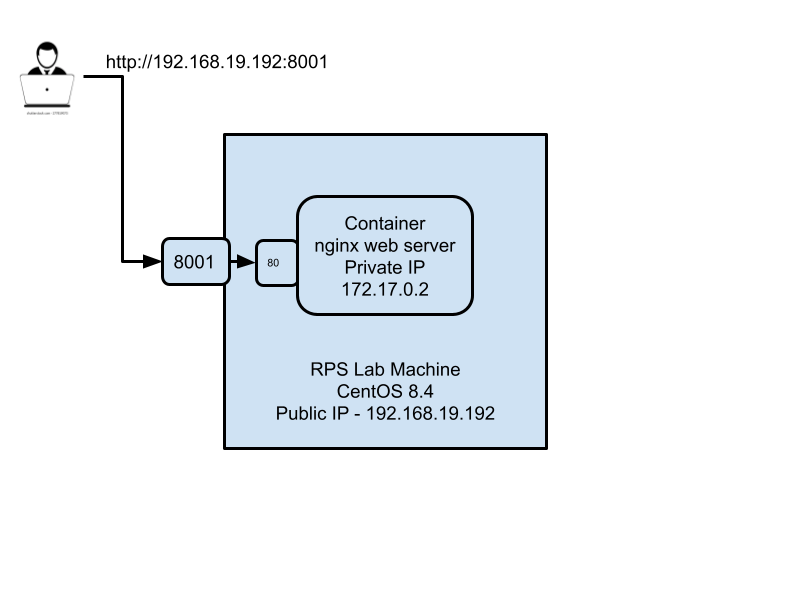
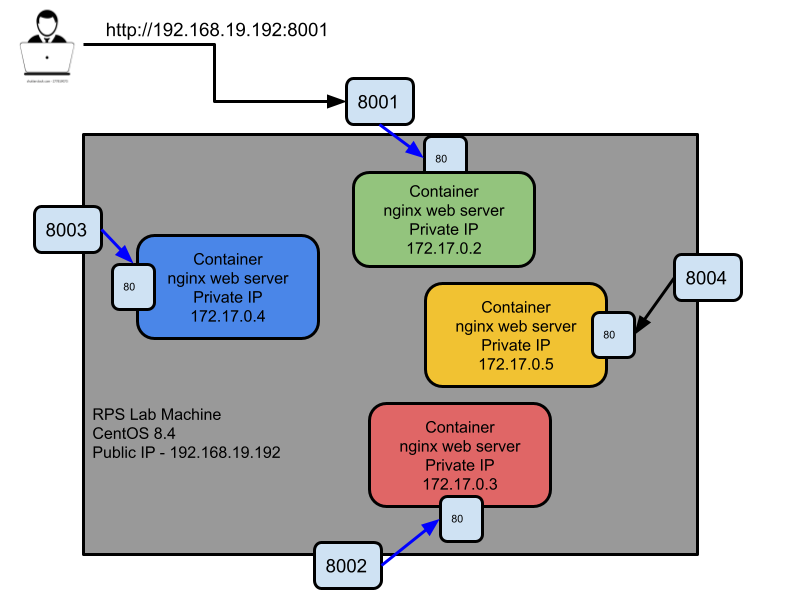

### Port Forwarding

The picture below demonstrates, how a single container can be accessed via Port Forwarding feature in Docker.


The picture below demonstrates, how fours containers can be accessed via different ports using Port Forwarding feature in Docker.


### Volume Mounting

Storing application data in container storage isn't considered as a best practice, the reason is when the container is removed by the Container Orchestrations Platforms the data will be lost.

Hence, we need to store the container application data in an external storage.  Volume mounting is the feature in Docker that allows you to store the application data in an external volume.

Creating a mysql container with volume mounting
```
mkdir -p /home/rps/mysql
docker run -d --name db1 --hostname db1 -v /home/rps/mysql:/var/lib/mysql -e MYSQL_ROOT_PASSWORD=root mysql:8
```
The expected output is
<pre>
[jegan@tektutor Day3]$ docker run -d --name db1 --hostname db1 -e MYSQL_ROOT_PASSWORD=root -v /home/rps/mysql:/var/lib/mysql mysql:8
0dd8bdf0d935940659d3efef7321c0855928c615044a8fd68effba8d653232fa
</pre>

You may now get inside the container and login via mysql client
```
docker exec -it db1 sh
mysql -u root -p
```
When prompted for mysql server password, type 'root' without quotes.
The expected output is
<pre>
[jegan@tektutor Day3]$ <b>docker exec -it db1 sh</b>
# mysql -u root -p
Enter password: 
Welcome to the MySQL monitor.  Commands end with ; or \g.
Your MySQL connection id is 8
Server version: 8.0.26 MySQL Community Server - GPL

Copyright (c) 2000, 2021, Oracle and/or its affiliates.

Oracle is a registered trademark of Oracle Corporation and/or its
affiliates. Other names may be trademarks of their respective
owners.

Type 'help;' or '\h' for help. Type '\c' to clear the current input statement.

mysql> 
</pre>

You may now create some database, tables and insert some records as shown below
```
CREATE DATABASE tektutor;
USE tektutor;
CREATE TABLE training (id int, name VARCHAR(25), duration VARCHAR(25));
INSERT INTO training VALUES ( 1, "DevOps", "5 days" );
INSERT INTO training VALUES ( 2, "Microservices", "5 days" );
INSERT INTO training VALUES ( 3, "OpenShift", "5 days" );
exit
exit
```
The expected output is
<pre>
[jegan@tektutor Day3]$ <b>docker exec -it db1 sh</b>
# mysql -u root -p
Enter password: 
Welcome to the MySQL monitor.  Commands end with ; or \g.
Your MySQL connection id is 8
Server version: 8.0.26 MySQL Community Server - GPL

Copyright (c) 2000, 2021, Oracle and/or its affiliates.

Oracle is a registered trademark of Oracle Corporation and/or its
affiliates. Other names may be trademarks of their respective
owners.

Type 'help;' or '\h' for help. Type '\c' to clear the current input statement.

mysql> <b>CREATE DATABASE tektutor;</b>
Query OK, 1 row affected (0.00 sec)

mysql> <b>USE tektutor;</b>
Database changed
mysql> <b>CREATE TABLE training (id int, name VARCHAR(25), duration VARCHAR(25));</b>
Query OK, 0 rows affected (0.03 sec)

mysql> <b>INSERT INTO training VALUES ( 1, "DevOps", "5 days" );</b>
Query OK, 1 row affected (0.02 sec)

mysql> <b>INSERT INTO training VALUES ( 2, "Microservices", "5 days" );</b>
Query OK, 1 row affected (0.00 sec)

mysql> <b>INSERT INTO training VALUES ( 3, "OpenShift", "5 days" );</b>
Query OK, 1 row affected (0.01 sec)

mysql> <b>exit</b>
Bye
# <b>exit</b>
</pre>

Now delete the db1 container
```
docker rm -f db1
```
Now let's create a new db container
```
docker run -d --name db2 --hostname db2 -v /home/rps/mysql:/var/lib/mysql -e MYSQL_ROOT_PASSWORD=root mysql:8
```
The expected output is
<pre>
[jegan@tektutor Day3]$ <b>docker rm -f db1</b>
db1
[jegan@tektutor Day3]$ <b>docker run -d --name db2 --hostname db2 -v /home/rps/mysql:/var/lib/mysql -e MYSQL_ROOT_PASSWORD=root mysql:8</b>
77b942116928ac3ada7c3035b95dd1553b932c8c2549b060c5bddadcac953bc0
</pre>

Let's get inside the db2 container
```
docker exec -it db2 sh
mysql -u root -p
SHOW DATABASES;
USE tektutor;
SHOW TABLES;
SELECT * FROM training;
exit
exit
```
Type password as 'root'.

The expected output is
<pre>
[jegan@tektutor Day3]$ <b>docker run -d --name db2 --hostname db2 -v /home/rps/mysql:/var/lib/mysql -e MYSQL_ROOT_PASSWORD=root mysql:8</b>
77b942116928ac3ada7c3035b95dd1553b932c8c2549b060c5bddadcac953bc0
[jegan@tektutor Day3]$ <b>docker exec -it db2 sh</b>
# mysql -u root -p
Enter password: 
Welcome to the MySQL monitor.  Commands end with ; or \g.
Your MySQL connection id is 8
Server version: 8.0.26 MySQL Community Server - GPL

Copyright (c) 2000, 2021, Oracle and/or its affiliates.

Oracle is a registered trademark of Oracle Corporation and/or its
affiliates. Other names may be trademarks of their respective
owners.

Type 'help;' or '\h' for help. Type '\c' to clear the current input statement.

mysql> <b>SHOW DATABASES;</b>
+--------------------+
| Database           |
+--------------------+
| information_schema |
| mysql              |
| performance_schema |
| sys                |
| tektutor           |
+--------------------+
5 rows in set (0.01 sec)

mysql> <b>USE tektutor;</b>
Reading table information for completion of table and column names
You can turn off this feature to get a quicker startup with -A

Database changed
mysql> <b>SHOW TABLES;</b>
+--------------------+
| Tables_in_tektutor |
+--------------------+
| training           |
+--------------------+
1 row in set (0.00 sec)

mysql> <b>SELECT * FROM training;</b>
+------+--------+----------+
| id   | name   | duration |
+------+--------+----------+
|    1 | DevOpS | 3 days   |
+------+--------+----------+
1 row in set (0.00 sec)

mysql> <b>exit</b>
Bye
# <b>exit</b>
</pre>

As you noticed, the data is intact(safe). We are able to access the data via another container i.e db2.

# Ansible Overview
- is a Configuration Management Tool 
- is a Infrastructure as a Code (Iaac) tool
- helps in automating adminstrative activities
    - provisioning machines (containers, Virtual Machines, Cloud based Virtual machines in AWS/Azure/GCP etc.,)
    - installing softwares, uninstalling softwares, configuring softwares, managing users
- is developed in Python by Michael Deehan
- Michael Deehan was a former employee of RedHat, he quit RedHat and incorporated Ansible Inc organization
- Michael Deehan develped <b>Ansible Core</b> as an Opensource project
- Later RedHat acquired Ansible Inc, hence Ansible Core is now maintained by RedHat(IBM) along with the Opensource community
 
- Ansible Core
   - is a CLI tool
   - Domain Specific Language (DSL) - YAML (Yet Another Markup Language - a superset of JSON)
   - to automated administrative activity Python knowledge is not mandatory
   - can be installed in Mac/Linux but can't be installed in Windows
   - can manage Unix,Mac,Linux and Windows Servers
   - you won't get support from RedHat(IBM) as this is developed by Opensource Community
   - The machine where Ansible is installed is called as Ansible Controller Machine (ACM)
   - From ACM we can writing automation scripts called Ansible Playbooks
   - Ansible Playbook will invoke one or more Ansible Modules
   - Ansible Modules are Python scripts for Unix/Linux/Mac Nodes
   - Ansible Modules are Powershell scripts for Windows Nodes
   - The servers that are managed by Ansible/Ansible AWX/Ansible Tower are called as Ansible Nodes
   - agentless
      - on the Ansible Nodes no proprietary software needs to be installed
      - general requirements
        Unix/Linux/Mac Ansible Nodes
          - should have Python installed
          - should have SSH Server installed
        Windows Ansible Nodes
          - should have Powershell (.Net Framework )
          - shoud have WinRM configured
 
- Ansible AWX (Opensource)
  - develped on top of Ansible Core
  - supports WebInterface
  - you won't get support from RedHat(IBM) as this is developed by Opensource Community
  
- RedHat developed Ansible Tower for Enterprise Customers 
   - is developed on top Ansible AWX
   - supports Web Interface, 
   - support Role Based Access Control
   - you could integrate with Active Directory
   - you can run the Ansible Playbook from your web browser
   - you get support from RedHat(IBM) as this is developed by RedHat(IBM)

- some alternate tools
    - Puppet
    - Chef
    - Salt (SaltStack)

### Generating SSH Key pairs for rps user
When it prompts for options, hit enter ( 3 times )
```
ssh-keygen
```

### Preparing a custom Ansible node image using Ubuntu as the base image
```
cd ~/Training/devops-sep-2021
git pull
cd Day3/Ansible/AnsibleNodeCustomDockerImages/ubuntu-ansible
cp ~/.ssh/id_rsa.pub authorized_keys
docker build -t tektutor/ansible-ubuntu-node .
```
The expected output is
<pre>
[jegan@tektutor AnsibleNodeCustomDockerImages]$ cd ubuntu-ansible/
[jegan@tektutor ubuntu-ansible]$ ls
Dockerfile
[jegan@tektutor ubuntu-ansible]$ </b>cp ~/.ssh/id_rsa.pub authorized_keys</b>
[jegan@tektutor ubuntu-ansible]$ <b>docker build -t tektutor/ansible-ubuntu-node .</b>
Sending build context to Docker daemon  4.096kB
Step 1/12 : FROM ubuntu:16.04
 ---> b6f507652425
Step 2/12 : MAINTAINER Jeganathan Swaminathan <jegan@tektutor.org>
 ---> Using cache
 ---> bd37dc33a524
Step 3/12 : RUN apt-get update && apt-get install -y openssh-server python3
 ---> Using cache
 ---> ff0d6fcd7eb3
Step 4/12 : RUN mkdir -p /var/run/sshd
 ---> Using cache
 ---> d7303fee625b
Step 5/12 : RUN echo 'root:root' | chpasswd
 ---> Running in 12199f9f664e
Removing intermediate container 12199f9f664e
 ---> fdf3d5a9a1c1
Step 6/12 : RUN sed -i 's/PermitRootLogin prohibit-password/PermitRootLogin yes/' /etc/ssh/sshd_config
 ---> Running in d0bfbe40e452
Removing intermediate container d0bfbe40e452
 ---> 558992859eee
Step 7/12 : RUN sed 's@session\s*required\s*pam_loginuid.so@session optional pam_loginuid.so@g' -i /etc/pam.d/sshd
 ---> Running in 8725f1239d8a
Removing intermediate container 8725f1239d8a
 ---> 6e0715994560
Step 8/12 : RUN mkdir -p /root/.ssh
 ---> Running in 77c67a1fc482
Removing intermediate container 77c67a1fc482
 ---> 7dbf8181e1f8
Step 9/12 : COPY authorized_keys /root/.ssh/authorized_keys
 ---> 6ebd7e6ecace
Step 10/12 : EXPOSE 22
 ---> Running in 5c9aae1600fa
Removing intermediate container 5c9aae1600fa
 ---> caa70866cedd
Step 11/12 : EXPOSE 80
 ---> Running in 1c6e88a9eef7
Removing intermediate container 1c6e88a9eef7
 ---> 61de81243617
Step 12/12 : CMD ["/usr/sbin/sshd", "-D"]
 ---> Running in 8ff9685c09e6
Removing intermediate container 8ff9685c09e6
 ---> 3340a12056f1
<b>Successfully built 3340a12056f1
Successfully tagged tektutor/ansible-ubuntu-node:latest</b>
</pre>

### Preparing a custom Ansible node image using CentOS as the base image
```
cd ~/Training/devops-sep-2021
git pull
cd Day3/Ansible/AnsibleNodeCustomDockerImages/centos-ansible
cp ~/.ssh/id_rsa.pub authorized_keys
docker build -t tektutor/ansible-centos-node .
```

The expected output is
<pre>
[jegan@tektutor centos-ansible]$ <b>docker build -t tektutor/ansible-centos-node .</b>
Sending build context to Docker daemon  10.24kB
Step 1/17 : FROM centos:8
 ---> 5d0da3dc9764
Step 2/17 : MAINTAINER Jeganathan Swaminathan <jegan@tektutor.org>
 ---> Running in c9b9a09b02d5
Removing intermediate container c9b9a09b02d5
 ---> 39c83551888c
Step 3/17 : RUN yum install -y openssh-server openssh-clients
 ---> Running in aad966af0422
CentOS Linux 8 - AppStream                      1.1 MB/s | 9.3 MB     00:08    
CentOS Linux 8 - BaseOS                         1.4 MB/s | 7.5 MB     00:05    
CentOS Linux 8 - Extras                          16 kB/s |  10 kB     00:00    
Dependencies resolved.
================================================================================
 Package              Arch        Version                     Repository   Size
================================================================================
Installing:
 openssh-clients      x86_64      8.0p1-6.el8_4.2             baseos      667 k
 openssh-server       x86_64      8.0p1-6.el8_4.2             baseos      484 k
Installing dependencies:
 libedit              x86_64      3.1-23.20170329cvs.el8      baseos      102 k
 openssh              x86_64      8.0p1-6.el8_4.2             baseos      521 k

Transaction Summary
================================================================================
Install  4 Packages

Total download size: 1.7 M
Installed size: 5.5 M
Downloading Packages:
(1/4): libedit-3.1-23.20170329cvs.el8.x86_64.rp 157 kB/s | 102 kB     00:00    
(2/4): openssh-8.0p1-6.el8_4.2.x86_64.rpm       419 kB/s | 521 kB     00:01    
(3/4): openssh-clients-8.0p1-6.el8_4.2.x86_64.r 463 kB/s | 667 kB     00:01    
(4/4): openssh-server-8.0p1-6.el8_4.2.x86_64.rp 482 kB/s | 484 kB     00:01    
--------------------------------------------------------------------------------
Total                                           852 kB/s | 1.7 MB     00:02     
warning: /var/cache/dnf/baseos-f6a80ba95cf937f2/packages/libedit-3.1-23.20170329cvs.el8.x86_64.rpm: Header V3 RSA/SHA256 Signature, key ID 8483c65d: NOKEY
CentOS Linux 8 - BaseOS                         1.4 MB/s | 1.6 kB     00:00    
Importing GPG key 0x8483C65D:
 Userid     : "CentOS (CentOS Official Signing Key) <security@centos.org>"
 Fingerprint: 99DB 70FA E1D7 CE22 7FB6 4882 05B5 55B3 8483 C65D
 From       : /etc/pki/rpm-gpg/RPM-GPG-KEY-centosofficial
Key imported successfully
Running transaction check
Transaction check succeeded.
Running transaction test
Transaction test succeeded.
Running transaction
  Preparing        :                                                        1/1 
  Running scriptlet: openssh-8.0p1-6.el8_4.2.x86_64                         1/4 
  Installing       : openssh-8.0p1-6.el8_4.2.x86_64                         1/4 
  Installing       : libedit-3.1-23.20170329cvs.el8.x86_64                  2/4 
  Installing       : openssh-clients-8.0p1-6.el8_4.2.x86_64                 3/4 
  Running scriptlet: openssh-server-8.0p1-6.el8_4.2.x86_64                  4/4 
  Installing       : openssh-server-8.0p1-6.el8_4.2.x86_64                  4/4 
  Running scriptlet: openssh-server-8.0p1-6.el8_4.2.x86_64                  4/4 
  Verifying        : libedit-3.1-23.20170329cvs.el8.x86_64                  1/4 
  Verifying        : openssh-8.0p1-6.el8_4.2.x86_64                         2/4 
  Verifying        : openssh-clients-8.0p1-6.el8_4.2.x86_64                 3/4 
  Verifying        : openssh-server-8.0p1-6.el8_4.2.x86_64                  4/4 

Installed:
  libedit-3.1-23.20170329cvs.el8.x86_64   openssh-8.0p1-6.el8_4.2.x86_64        
  openssh-clients-8.0p1-6.el8_4.2.x86_64  openssh-server-8.0p1-6.el8_4.2.x86_64 

Complete!
Removing intermediate container aad966af0422
 ---> 46c8a7fe1138
Step 4/17 : RUN ln -s -f /usr/libexec/platform-python3.6 /usr/bin/python
 ---> Running in 6816c6850c2f
Removing intermediate container 6816c6850c2f
 ---> ea42dc05e80c
Step 5/17 : RUN echo 'root:root' | chpasswd
 ---> Running in a56f71f9bf9b
Removing intermediate container a56f71f9bf9b
 ---> d0051b2582b7
Step 6/17 : RUN usermod -aG wheel root
 ---> Running in db5e34c05572
Removing intermediate container db5e34c05572
 ---> fe9c543ba0df
Step 7/17 : RUN sed -ri 's/^session\s+required\s+pam_loginuid.so$/session optional pam_loginuid.so/' /etc/pam.d/sshd
 ---> Running in f7ac895400f4
Removing intermediate container f7ac895400f4
 ---> ce88d958dd38
Step 8/17 : COPY sshd_config /etc/ssh/sshd_config
 ---> b55ac2897e43
Step 9/17 : COPY sudoers /etc/sudoers
 ---> fc01794f064f
Step 10/17 : RUN mkdir -p /root/.ssh
 ---> Running in 5e08e05a09ae
Removing intermediate container 5e08e05a09ae
 ---> 219e10d57261
Step 11/17 : COPY authorized_keys /root/.ssh/authorized_keys
 ---> c3f894dd50d3
Step 12/17 : RUN chmod 700 -R /root/.ssh
 ---> Running in 136a1d334120
Removing intermediate container 136a1d334120
 ---> eb624741c512
Step 13/17 : RUN mkdir -m 700 /var/run/sshd
 ---> Running in a77cdcc9346b
Removing intermediate container a77cdcc9346b
 ---> fca7f9e453ff
Step 14/17 : RUN ssh-keygen -A && rm -f /run/nologin
 ---> Running in bbfb19561a4e
ssh-keygen: generating new host keys: RSA DSA ECDSA ED25519 
Removing intermediate container bbfb19561a4e
 ---> 6c66fb5c65c3
Step 15/17 : EXPOSE 22
 ---> Running in 4fc9f034cea8
Removing intermediate container 4fc9f034cea8
 ---> 5556348bbb09
Step 16/17 : EXPOSE 80
 ---> Running in 89de4eec60a6
Removing intermediate container 89de4eec60a6
 ---> 6b3c154fd98a
Step 17/17 : CMD ["/usr/sbin/sshd", "-D"]
 ---> Running in db2e1aaf8f35
Removing intermediate container db2e1aaf8f35
 ---> 3724c29f8afe
<b>Successfully built 3724c29f8afe
Successfully tagged tektutor/ansible-centos-node:latest</b>
</pre>

### List and see if the custome images are there
```
docker images
```

The expected output is
<pre>
[jegan@tektutor ubuntu-ansible]$ <b>docker images</b>
REPOSITORY                                TAG       IMAGE ID       CREATED          SIZE
<b>tektutor/ansible-ubuntu-node              latest    3340a12056f1   3 minutes ago    220MB
tektutor/ansible-centos-node              latest    3724c29f8afe   11 minutes ago   284MB</b>
alpine-myubuntu                           latest    dc338710c6fa   20 hours ago     8.63MB
myubuntu                                  latest    0465102ea9b9   21 hours ago     112MB
nginx                                     1.20      10e31fc2b144   25 hours ago     133MB
mysql                                     8         2fe463762680   25 hours ago     514MB
centos                                    8         5d0da3dc9764   13 days ago      231MB
docker.bintray.io/jfrog/artifactory-oss   latest    f96008c316f4   2 weeks ago      980MB
ubuntu                                    16.04     b6f507652425   4 weeks ago      135MB
ubuntu                                    20.04     fb52e22af1b0   4 weeks ago      72.8MB
alpine                                    3         14119a10abf4   4 weeks ago      5.6MB
</pre>

### Creating ubuntu ansible node containers
```
docker run -d --name ubuntu1 --hostname ubuntu1 -p 2001:22 -p 8001:80 tektutor/ansible-ubuntu-node 
docker run -d --name ubuntu2 --hostname ubuntu2 -p 2002:22 -p 8002:80 tektutor/ansible-ubuntu-node 
```
List and see if the ubuntu1 and ubuntu2 containers are running
```
docker ps
```
The expected output is
<pre>
[jegan@tektutor]$ <b>docker run -d --name ubuntu1 --hostname ubuntu1 -p 2001:22 -p 8001:80 tektutor/ansible-ubuntu-node
a3f850f89f107c31afcd830ddb9bca2956d507b22ccbcfd769f3b26b83cb9bb1</b>
[jegan@tektutor]$ <b>docker run -d --name ubuntu2 --hostname ubuntu2 -p 2002:22 -p 8002:80 tektutor/ansible-ubuntu-node
3d8f281d1f89e8fd751dbd335c4a15783d81292b4735f961653bc1bd61a4745c</b>
[jegan@tektutor]$ <b>docker ps</b>
CONTAINER ID   IMAGE                          COMMAND               CREATED          STATUS          PORTS                                                                          NAMES
<b>3d8f281d1f89   tektutor/ansible-ubuntu-node   "/usr/sbin/sshd -D"   4 seconds ago    Up 1 second     0.0.0.0:2002->22/tcp, :::2002->22/tcp, 0.0.0.0:8002->80/tcp, :::8002->80/tcp   ubuntu2
a3f850f89f10   tektutor/ansible-ubuntu-node   "/usr/sbin/sshd -D"   15 seconds ago   Up 13 seconds   0.0.0.0:2001->22/tcp, :::2001->22/tcp, 0.0.0.0:8001->80/tcp, :::8001->80/tcp   ubuntu1</b>
</pre>

### Creating centos ansible node containers
```
docker run -d --name centos1 --hostname centos1 -p 2003:22 -p 8003:80 tektutor/ansible-centos-node 
docker run -d --name centos2 --hostname centos2 -p 2004:22 -p 8004:80 tektutor/ansible-centos-node 
```
List and see if the centos1 and centos2 containers are running
```
docker ps
```
The expected output is
<pre>
[jegan@tektutor]$ <b>docker run -d --name centos1 --hostname centos1 -p 2003:22 -p 8003:80 tektutor/ansible-centos-node</b>
653251b6ff22165fd90a7ab732cc7e11b7972d5c1b43b6276e73d1c2f7f9bd68
[jegan@tektutor]$ <b>docker run -d --name centos2 --hostname centos2 -p 2004:22 -p 8004:80 tektutor/ansible-centos-node</b>
d8b5ab3dc18b89841b4c5f5ffb8b909e2ed6e5124810eebf1d61b27430857a76
[jegan@tektutor]$ <b>docker ps</b>
CONTAINER ID   IMAGE                          COMMAND               CREATED          STATUS          PORTS                                                                          NAMES
<b>d8b5ab3dc18b   tektutor/ansible-centos-node   "/usr/sbin/sshd -D"   4 seconds ago    Up 3 seconds    0.0.0.0:2004->22/tcp, :::2004->22/tcp, 0.0.0.0:8004->80/tcp, :::8004->80/tcp   centos2
653251b6ff22   tektutor/ansible-centos-node   "/usr/sbin/sshd -D"   15 seconds ago   Up 14 seconds   0.0.0.0:2003->22/tcp, :::2003->22/tcp, 0.0.0.0:8003->80/tcp, :::8003->80/tcp   centos1</b>
3d8f281d1f89   tektutor/ansible-ubuntu-node   "/usr/sbin/sshd -D"   15 minutes ago   Up 15 minutes   0.0.0.0:2002->22/tcp, :::2002->22/tcp, 0.0.0.0:8002->80/tcp, :::8002->80/tcp   ubuntu2
a3f850f89f10   tektutor/ansible-ubuntu-node   "/usr/sbin/sshd -D"   15 minutes ago   Up 15 minutes   0.0.0.0:2001->22/tcp, :::2001->22/tcp, 0.0.0.0:8001->80/tcp, :::8001->80/tcp   ubuntu1
</pre>

### Check if you are able to SSH into ubuntu1 ansible node container
```
ssh -p 2001 root@localhost
```

The expected output is
<pre>
[jegan@tektutor]$ <b>ssh -p 2001 root@localhost</b>
The authenticity of host '[localhost]:2001 ([::1]:2001)' can't be established.
ECDSA key fingerprint is SHA256:gylBIvnwp8vrM+F3WTVqCLVXq01ZBllfYg9qw+GYIok.
Are you sure you want to continue connecting (yes/no/[fingerprint])? <b>yes</b>
Warning: Permanently added '[localhost]:2001' (ECDSA) to the list of known hosts.
Welcome to Ubuntu 16.04.7 LTS (GNU/Linux 4.18.0-240.el8.x86_64 x86_64)

 * Documentation:  https://help.ubuntu.com
 * Management:     https://landscape.canonical.com
 * Support:        https://ubuntu.com/advantage

The programs included with the Ubuntu system are free software;
the exact distribution terms for each program are described in the
individual files in /usr/share/doc/*/copyright.

Ubuntu comes with ABSOLUTELY NO WARRANTY, to the extent permitted by
applicable law.

root@ubuntu1:~# <b>exit</b>
logout
Connection to localhost closed.
</pre>

### Check if you are able to SSH into ubuntu2 ansible node container
```
ssh -p 2002 root@localhost
```

The expected output is
<pre>
[jegan@tektutor]$ <b>ssh -p 2002 root@localhost</b>
The authenticity of host '[localhost]:2002 ([::1]:2002)' can't be established.
ECDSA key fingerprint is SHA256:gylBIvnwp8vrM+F3WTVqCLVXq01ZBllfYg9qw+GYIok.
Are you sure you want to continue connecting (yes/no/[fingerprint])? yes
Warning: Permanently added '[localhost]:2002' (ECDSA) to the list of known hosts.
Welcome to Ubuntu 16.04.7 LTS (GNU/Linux 4.18.0-240.el8.x86_64 x86_64)

 * Documentation:  https://help.ubuntu.com
 * Management:     https://landscape.canonical.com
 * Support:        https://ubuntu.com/advantage

The programs included with the Ubuntu system are free software;
the exact distribution terms for each program are described in the
individual files in /usr/share/doc/*/copyright.

Ubuntu comes with ABSOLUTELY NO WARRANTY, to the extent permitted by
applicable law.

root@ubuntu2:~# <b>exit</b>
logout
Connection to localhost closed.
</pre>

### Check if you are able to SSH into centos1 ansible node container
```
ssh -p 2003 root@localhost
```

The expected output is
<pre>
[jegan@tektutor]$ <b>ssh -p 2003 root@localhost</b>
The authenticity of host '[localhost]:2003 ([::1]:2003)' can't be established.
ECDSA key fingerprint is SHA256:bipIHYUJaG+NiaJ1WHyFNOG7C3hbyJv+BuRDMBlgeVU.
Are you sure you want to continue connecting (yes/no/[fingerprint])? yes
Warning: Permanently added '[localhost]:2003' (ECDSA) to the list of known hosts.
[root@centos1 ~]# exit
logout
Connection to localhost closed.
[jegan@tektutor ubuntu-ansible]$ 
</pre>

### Check if you are able to SSH into centos2 ansible node container
```
ssh -p 2004 root@localhost
```

The expected output is
<pre>
[jegan@tektutor]$ <b>ssh -p 2004 root@localhost</b>
The authenticity of host '[localhost]:2004 ([::1]:2004)' can't be established.
ECDSA key fingerprint is SHA256:bipIHYUJaG+NiaJ1WHyFNOG7C3hbyJv+BuRDMBlgeVU.
Are you sure you want to continue connecting (yes/no/[fingerprint])? <b>yes<b>
Warning: Permanently added '[localhost]:2004' (ECDSA) to the list of known hosts.
[root@centos2 ~]# <b>exit</b>
logout
Connection to localhost closed.
</pre>

### Run your first ansible ad-hoc command
```
cd ~/Training/devops-sep-2021
git pull
cd Day3/Ansible
ansible -i hosts all -m ping
```
In the above ansible ad-hoc command
```
|-------|---------------------------------------------------------------------------------|
|option | description                                                                     |
|ansible| utility that is used to run any ansible ad-hoc command                          |
|i      |indicates inventory                                                              |
|hosts  |is the inventory file name                                                       |
|m      |indicates ansible module                                                         |
|ping   |is the ansible module ( python script that comes out of the box with Ansible)    |
|-----------------------------------------------------------------------------------------|
```

The expected output is
<pre>
[jegan@tektutor Ansible]$ <b>ansible -i hosts all -m ping</b>
ubuntu2 | SUCCESS => {
    "ansible_facts": {
        "discovered_interpreter_python": "/usr/bin/python3"
    },
    "changed": false,
    "ping": "pong"
}
ubuntu1 | SUCCESS => {
    "ansible_facts": {
        "discovered_interpreter_python": "/usr/bin/python3"
    },
    "changed": false,
    "ping": "pong"
}
</pre>

### Other commonly used ansible ad-hoc commands
```
ansible -i hosts all -m shell -a "hostname"
ansible -i hosts all -m shell -a "hostname -i"
ansible -i hosts ubuntu1 -m ping
ansible -i hosts ubuntu2 -m setup
```

### Running your first Ansible Playbook
```
cd ~/Training/devops-sep-2021
git pull
cd Day3/Ansible
ansible-playbook ping.yml
```
The expected output is
<pre>
[jegan@tektutor Ansible]$ ansible-playbook ping.yml 

PLAY [This playbook demonstrates using ping ansible module] *************************************************************

TASK [Gathering Facts] **************************************************************************************************
ok: [ubuntu2]
ok: [ubuntu1]
ok: [centos2]
ok: [centos1]

TASK [Ping the node] ****************************************************************************************************
ok: [ubuntu2]
ok: [ubuntu1]
ok: [centos1]
ok: [centos2]

PLAY RECAP **************************************************************************************************************
centos1                    : ok=2    changed=0    unreachable=0    failed=0    skipped=0    rescued=0    ignored=0   
centos2                    : ok=2    changed=0    unreachable=0    failed=0    skipped=0    rescued=0    ignored=0   
ubuntu1                    : ok=2    changed=0    unreachable=0    failed=0    skipped=0    rescued=0    ignored=0   
ubuntu2                    : ok=2    changed=0    unreachable=0    failed=0    skipped=0    rescued=0    ignored=0   
</pre>
